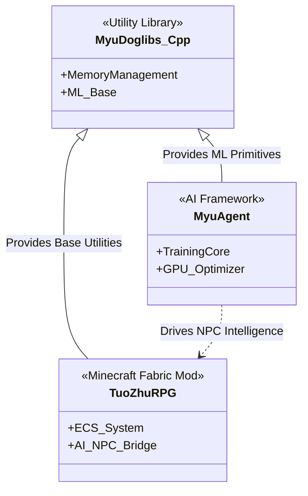

# <h1><p align="center"> M4ng0D0g@dev:~ </p></h1>

<p align="center">
  <!-- C++ -->
  
  <!-- Java -->
  
  <!-- Minecraft Fabric -->
  
  <!-- AI Learning -->
  
</p>
---

### 📟 System Boot Sequence
```bash
> Initializing chiayu.sys...
> Loading C++ Standard Libraries... [OK]
> Mounting AI Training Datasets... [OK]
> Starting Minecraft Fabric Environment... [OK]
> Synchronizing Japanese N5 Grammar... [IN PROGRESS]
```

## 🏗️ Project Ecosystem


## 📊 Analytics & Status
<p align="center">
  <!-- GitHub 統計 -->
  
  
  <!-- WakaTime 開發時數 -->
  
</p>

### 🎵 Currently Tuning
<p align="left">
  <a href="https://spotify-github-profile.vercel.app/api/view?uid=你的SpotifyID&cover_image=true&theme=tokyonight">
    
  </a>
</p>

## 🎼 /dev/lifestyle
<!-- 這裡之後會放音樂與語言學習內容 -->

---

<p align="center">
  "Keep optimizing, stay curious."
</p>
 
